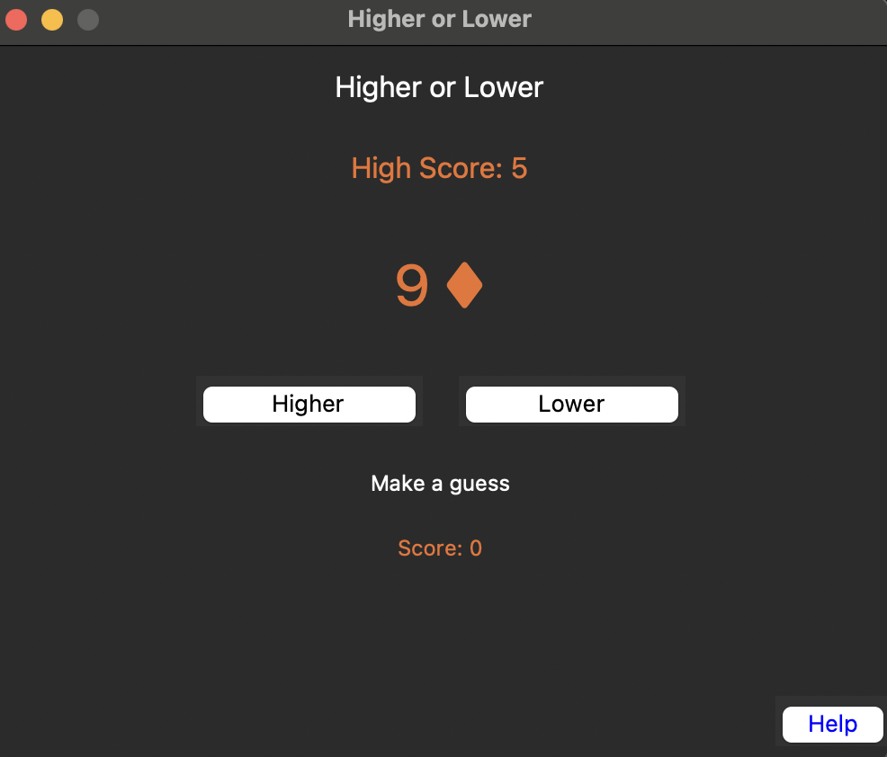
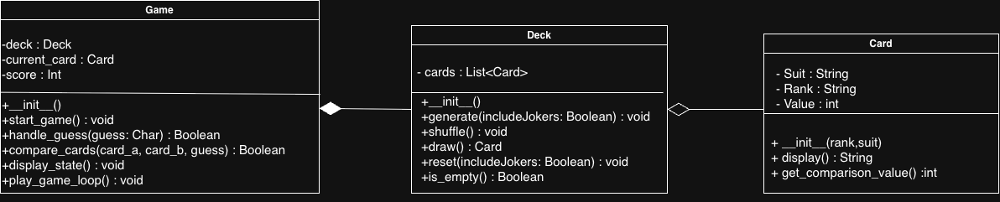

# higher-lower-game

<p align="center">
  
</p>

## Prerequisite 
- Python3, tested with version 3.13.5
### Packages
- Tkinter for the GUI, tested using TKinter 8.6.16

**For MacOS**
```
brew install tcl-tk
brew install python-tk
```

## How to start
1. Clone the repository
2. Enter the project directory
3. Execute: `python main.py`

## How to play
- A card will be shown
- Using the buttons (Higher/Lower), make a guess whether the next card will be higher or lower
- If the guess is correct, you earn a point and will move onto the next card
- If it was a tie (i.e. the next card was of the same rank), then no change to the score and the game continues
- If the guess was incorrect, then Game Over, then you will be given the chance to restart

_Note: In this implementation of the game 'Higher or Lower' Ace is considered as the lowest card with a value of 1_

## Shuffling Algorithm
This project uses the Fisher-Yates shuffling algorithm. This is a very common shuffling algorithm.
The algorithm works by doing the following:
1. Iterate through the cards in the deck
2. At each index `i`, pick a random index `j` between `0` and `i` (picking up to `i` avoids an index out of range error)
3. Swap the cards between index `i` and index `j` (card at index `j` will be the card at `i` and card at `i` would be the card that was in `j`)
4. Repeat steps 2 - 3 until the end of the deck

### Evaluation of Shuffling Algorithm
The Fisher-Yates algorithm is a very popular algorithm due to its simplicity, efficiency, uniformity, and space complexity.

#### Simplicity
The algorithm is very simple to implement using only a few short lines; additionally, it is very easy to understand what processes take place. 

#### Efficiency
This algorithm shuffles the deck in one pass, which in turn results in a time complexity of O(n), looping through the deck one time to shuffle the cards. 

#### Uniformity
The
Fisher-Yates algorithm is able to generate a perfectly random permutation, meaning that every possible ordering of the sequence is equally likely.

#### Space Complexity
Shuffling with this algorithm is done in-place. Therefore, the shuffling modifies the array directly without needing to create a new one. This results in O(1) space complexity. 

### Why was this algorithm used?
Unlike the Fisher-Yates algorithm, a naive swap-based algorithm produces a non-uniform distribution, making some permutations more likely. Additionally, the naive swap-based approach has a bias that grows with repeated passes and therefore is not a good approach. 
Another example of a shuffling approach is using the random-sort approach, such as a merge-sort shuffle. This would lead to having O(nlogn), which is a worse time complexity than the Fisher-Yates.

The Fisher-Yates algorithm was chosen for its simplicity, efficiency, and uniformity. It effectively shuffles the deck.  

## Design decisions
The following diagram was created with CLI implementation in mind; therefore, some functions have been deprecated once the GUI was integrated. 


<p align="center">
  
</p>

### Card
A card class was created to represent a physical game card. 
This class contains information about the card:
- Suit: The suit the card was (Heart, Diamond, Club, Spades)
- Rank: The Rank of the card (Ace, 2, 3, ..., Jack, Queen, King)
- Value: Internal number to use for comparison between the ranks of cards to know if higher or lower. This value would be mapped from the rank (Ace -> 1,2 -> 2, ..., Queen -> 12, King ->13)

Additionally, this class contains the methods:
- display (\_\_str\__): Converts the information about the card into a string to display on the GUI in the format: Rank Suit
- get_comparison_value: Returns the value to use for comparison

### Deck
This class represents a physical deck of cards. The only data it holds is the list of cards. However, it has some useful methods:
- generate: Creates the deck by populating the list of cards with the 52 cards
- shuffle: Runs the Fisher-Yates algorithm to shuffle the deck of cards
- draw: takes the top card in the deck
- reset: resets the deck to an empty list
- is_empty: returns `True` if the deck is empty, `False` otherwise

### Game
This class handles the game logic. It stores the deck instance, score, the current card (card being compared with), and the previous card (card being compared to). 
Additionally, this class also makes use of the Result Enum, created to help make the comparison between cards more secure and stable. 

The Game class holds crucial game logic functions, including:
- start_game: Sets up the game, called at the start of the game and when restarting, resets the deck and configures the deck with shuffled cards
- handle_guess: Evaluates the player's guess against the actual card comparison result
- compare_cards: Compares the current card to the previous card and determines the result
- next_round (not in diagram): An additional function added during the development phase, which updates the previous card to the current card and draws a new card from the deck
- play_game_loop: This function was designed to handle the game loop, prompting the user to enter input; however, this was deprecated after the GUI implementation

## Additional Features
The game uses a GUI which allows the user to have straightforward and streamlined interactions with the game, making it more enjoyable to play. It includes a helpful overlay that provides clear instructions on playing 'Higher or Lower', making it accessible to new players. Lastly, the game also has the ability to store the historical high score, encouraging players to beat previous records and adding a competitive edge that boosts replay value.

## Future Improvements
New features could be created to make the game more enjoyable and increase its replayability, such as providing different game modes, for example, guessing the next suit along with higher or lower. 

There are some improvements that could be made to improve the game.
Such improvements include:
- Usability: Improving error handling to ensure players can keep playing in the face of errors, and introducing key bindings to allow for faster and smoother gameplay
- Accessibility: Improving contrast between colours, making scalable text to allow for improved readability, and screen-reader compatibility to allow visually impaired users to play
- Tamper-resistant data: Ensuring high score text file cannot be tampered with and show false scores
- File Handling: Currently only handling FileNotFoundError, however, need to consider empty files, invalid value stored in the file, and any IO errors when reading the file
